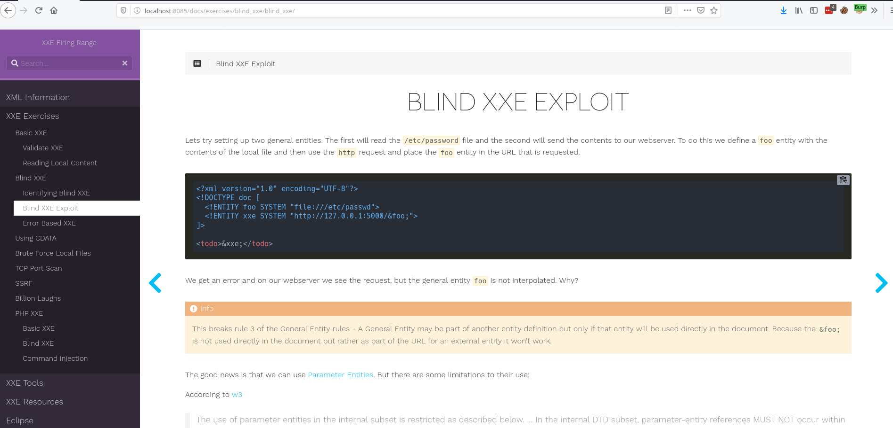
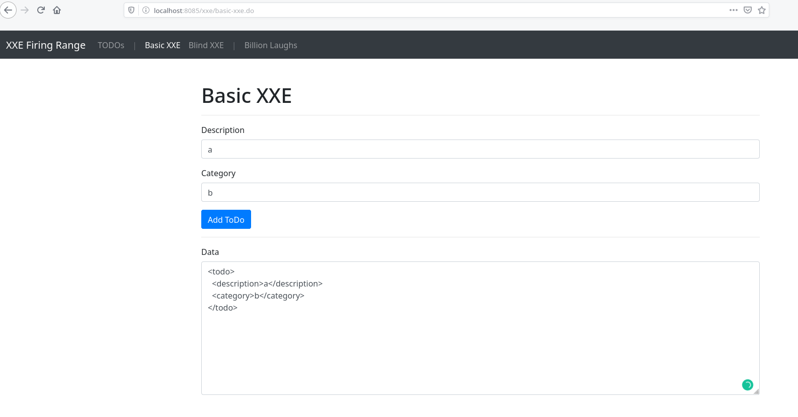
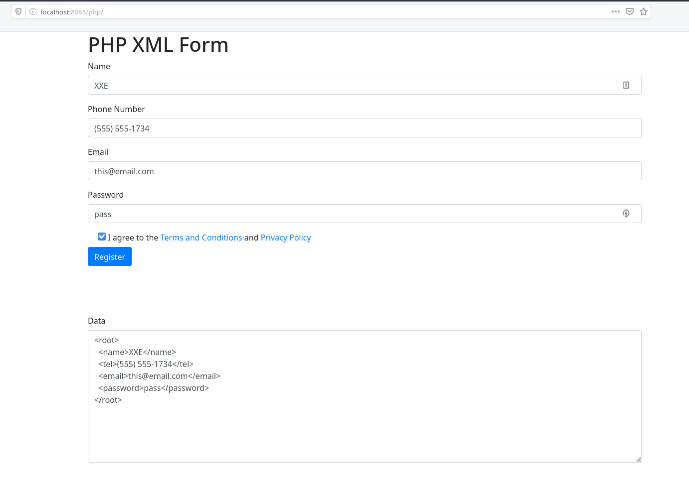

# XXE Firing Range

The XXE Firing Range (xxefr) is designed to provide a learning environment for XXE attacks. xxefr is a Vagrant-based virtual machine provisioned with Ansible and has three components: a documentation site, a Java application and a PHP application. The vagrant box also includes an Eclipse install so that you can view and modify the Java app.

## Starting xxefr

**System Requirements**:

* VirtualBox
* Vagrant
* Ansible
* Port 8085 free

**Cloning XXEFR**:

```
git clone --recursive https://github.com/tjcim/xxefr
cd xxefr
vagrant up
```

Once up visit https://localhost:8085, there you will find links to the documentation site as well as the Java application.

Java Application Username/Password: `user@xxefr.com`:`xxe`

## XXEFR Components

### Documentation Site

http://localhost:8085/docs/

#### Exercises

First we review a bit about XML, define DTDs as well as Entities and then establish some rules for both to follow while building your attacks. The documentation then has exercises and example attacks that can be used against the Java application and the PHP application.

* Basic XXE
* Blind XXE
* Error-based XXE
* Using CDATA
* Brute-force local files
* TCP port scan
* SSRF
* Billion-laughs DOS
* XXE to RCE

#### Tools

Tools are available in the `/home/vagrant/tools` directory and the documentation includes exercises on how to use each.

* xxeftp
* 230-OOB
* XXEinjector



### Java Site

http://localhost:8085/xxe/

Practice the exercises found in the documentation site and practice them here. The Java site has three main endpoints:

* Protected - this endpoint follows OWASP guidelines and should be protected from XXE
* Basic - this endpoint allows for basic XXE exploits
* Blind - this endpoint only allows for blind or error-based exploits



### PHP Site

http://localhost:8085/php/

There are some specific exercises for the PHP site that include some differences between it an Java. In addition you will be able to practice Remote Code Execution as well as upload a webshell all using XXE.




## URLs for the apps

* Hugo docs: http://localhost:8085/docs/
* Java Site: http://localhost:8085/xxe/
* PHP Site: http://localhost:8085/php/
* Firing Range run from Eclipse: http://localhost:9090/xxe/ `*`
* Hugo dev server: http://localhost:1313 `*`

`*` - These are not started by default

## Local Files

* DTD files are found here: `/home/vagrant/dtds`
* Test files are found here: `/home/vagrant/test_files`
* XXE tools are found here: `/home/vagrant/tools`

# TODO

* Move from xxe_java to xxefr
* Read through the site to make sure it all works and check for spelling errors
* Figure out how to deploy app to DO
* Publish to github

# DO Changes

* Vagrantfile
* Nginx for port 80/443
* Letsencrypt
* Hugo baseURL
* Nginx will need to serve the DTD files from the localhost (python will not allow multiple threads)
